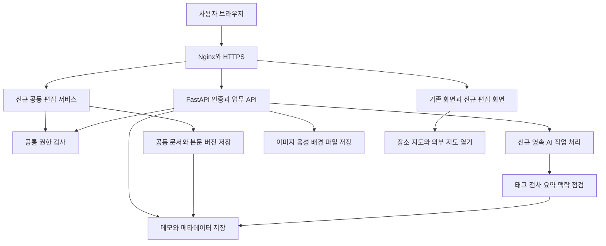

# TOCO 프로젝트 제안서

## 기록의 맥락과 관계를 보존하는 개인 및 소규모 팀 지식 공간

- 작성일: 2026년 9월 15일
- 제안 대상: 기존 TOCO 프로토타입의 후속 개발
- 개발 기간: 착수일부터 12주
- 최종 산출물: 기존 기록 기능과 7개 신규 기능을 연결한 기능 통합 알파
- 계획 가정: 주 15~20시간, 총 180 ~ 240시간. 실제 참여 인원과 투입 시간은 착수 시 확정한다.

TOCO는 사용자가 남긴 메모와 자료를 AI로 분석하고, 관련 기록을 그래프로 연결하여 다시 찾아 활용하도록 돕는 웹 서비스다. 이번 프로젝트에서는 기존 메모·그래프·공유·AI 질문 기능을 바탕으로 공동 편집, 음성 기록, 장소 정보, 맥락 보완, 개인화 기능을 통합한다. **12주 후에는 소규모 참여자가 기록을 함께 작성하고, 시간이 지나도 이해할 수 있게 보완하며, 실제 작업에 다시 활용하는 전 과정을 시연할 수 있어야 한다.**

최신 [기능 개발 3개월 로드맵](TOCO_기능개발_3개월_로드맵.md)을 실행 방향으로 삼는다. 이전 [베타 출시 중심 발전 계획](TOCO_3개월_발전계획.md)의 기술적 점검 결과는 참고하되, 초대 사용자 20~30명 확보나 결제 출시는 이번 완료 조건으로 적용하지 않는다.

## 1 제안 요약

| 질문 | 제안 내용 |
|---|---|
| 왜 만드는가 | 기록을 남긴 뒤 관련 내용을 다시 찾기 어렵고, 작성 당시의 맥락을 잊거나 다른 사람에게 설명하기 어려운 문제를 해결한다. |
| 무엇을 만드는가 | 텍스트·이미지·영상·음성·장소를 메모에 연결하고, AI와 사용자가 맥락을 보완하며, 소규모 팀이 함께 편집하는 지식 공간을 만든다. |
| 어떻게 만드는가 | 현재 HTML/CSS/JavaScript·D3.js·FastAPI·DynamoDB 기반을 확장한다. 본문 저장과 AI 처리를 분리하고, 공동 편집·음성 처리·지도·테마를 단계적으로 연결한다. 공유 개발 서버에는 자동배포를 구축한다. |
| 무엇으로 성공을 판단하는가 | 7개 기능의 통합 시나리오, 저장·권한·동기화 검증, AI 맥락 점검의 유용성, 사용자의 실제 원문 재방문과 활용 여부로 평가한다. |
| 어디까지 구현하는가 | 웹 기반 통합 알파까지 구현한다. 공동 편집은 본문 2~5명, 음성은 한국어 한 화자 중심 최대 10분, 내부 지도는 공급자 1개, 테마는 정해진 설정 항목으로 한정한다. |

## 2 왜 만드는가

### 2.1 해결하려는 문제

1. **기록이 쌓여도 다시 찾기 어렵다.** 제목이나 검색어를 기억하지 못하면 관련 메모를 놓친다. 폴더가 달라지면 같은 주제의 자료를 함께 살펴보기 어렵다.
2. **작성 당시의 맥락이 사라진다.** “이 방식이 느렸다”처럼 대상·상황·이유가 빠진 메모는 나중의 자신과 팀원 모두 이해하기 어렵다.
3. **자료의 형식과 보관 장소가 나뉜다.** 메모, 영상 링크, 음성 파일, 지도에 저장한 장소가 분리되어 하나의 작업에 활용하기 번거롭다.
4. **공유 이후의 발전 과정이 끊긴다.** 자료를 공유해도 함께 수정하고 이해를 맞추는 작업, 최종 결과물에 연결하는 작업이 별도로 필요하다.

위 문제는 기존 결과보고서와 로드맵에서 도출한 사용자 문제 가설이다. 현재 저장소에는 시간 절감이나 재사용 증가를 입증하는 사용자 실험 결과가 없으므로, 착수 초기의 관찰과 알파 사용 평가로 확인한다.

### 2.2 주요 사용자와 이용 상황

| 사용자 | 대표 상황 | 제공할 가치 |
|---|---|---|
| 학습 내용을 기록하는 학생·개발자 | 강의, 기술 실험, 영상 자료를 정리하고 발표나 개발에 다시 활용 | 관련 기록 발견, 원문 확인, 불명확한 실험 조건 보완 |
| 2~5인 스터디·프로젝트 팀 | 회의와 조사 내용을 함께 수정하고 자료 공유 | 본문 공동 편집, 동일한 맥락 확인, 권한에 맞는 참여 |
| 장소와 경험을 기록하는 개인·소규모 모임 | 여행 계획, 방문 기록, 맛집·명소 저장 | 장소·작성 위치·음성을 연결한 기록과 외부 지도 이동 |

학습·프로젝트 기록을 핵심 사용 대상으로 삼고, 여행·장소 기록은 입력 방식과 기능 통합을 검증하는 보조 시나리오로 사용한다. 테마는 기록 공간을 자신에게 맞게 표현하는 수단이며, 주요 성과는 기록의 이해와 활용으로 평가한다.

### 2.3 프로젝트의 차별화 방향

TOCO가 집중할 가치는 **기록의 관계, 이해 가능한 맥락, 재사용 행동을 연결하는 것**이다. 자동 태그와 그래프로 관련 기록을 발견하고, AI 점검으로 부족한 정보를 확인하며, 사용자 피드백으로 실제 이해와 활용 여부를 확인한다. 경쟁 제품 대비 우월성이나 시장성을 이미 검증했다고 전제하지 않는다.

## 3 현재까지의 프로젝트 진행사항

### 3.1 진행 단계

기존 6월 결과보고서와 발표자료에는 기획, 기본 웹 구조, 메모·그래프·공유, 첨부·RAG, 로컬 실행 환경을 순차적으로 개발한 내용이 기록되어 있다. 현재 코드는 여기에 일기·달력, 프로필, 팔로우, DM 등도 포함한다. 이후 9월 작성된 문서에서 후속 개발 방향을 7개 기능 중심으로 정리했다.

**현재 단계는 기능을 폭넓게 구현한 프로토타입이다.** 아래의 ‘구현’은 소스와 화면 처리 경로가 존재한다는 의미다. 실제 서버의 통합 동작, 외부 서비스 연결, 성능, 사용자 만족도가 검증되었다는 의미는 아니다.

### 3.2 구현 현황

| 영역 | 현재 코드에서 확인한 내용 | 후속 개발에서 필요한 작업 |
|---|---|---|
| 계정·인증 | 회원가입, 로그인, 액세스 토큰, refresh token 발급·갱신·폐기 | 개발용 인증 설정 분리, 세션 만료 정책, 접근 권한 회귀 검사 |
| 메모·폴더·일기 | 제목·본문 작성/수정/삭제, 폴더 생성·정렬·이동, 일기 날짜와 달력 | 본문 우선 저장, 저장 상태·실패 복구, 기존 일기 동작 유지 |
| AI 태그·그래프 | 제목·본문에서 태그·임베딩 생성, 메모/태그 관계 계산, D3 그래프 | 처리 상태 분리, 규모별 측정, 그래프 조작 안내와 불필요한 재계산 감소 |
| 검색·RAG | 로드된 그래프의 문자열 필터, 메모·영상 요약에서 상위 문맥 검색, 질문 답변과 관련 원문 이동 | 검색 범위·권한 일치, 근거 부족 응답 평가. 전체 기록 검색과 정밀 구간 검색은 별도 확장 |
| 이미지·영상 첨부 | S3 이미지 저장·표시, 첨부 순서 변경, YouTube 메타데이터·요약 저장 | 이미지 저장/삭제 정합성 검증, 실패 원인 표시, 자막 확보 여부와 요약 범위 안내 |
| 공유·그룹 | 공개/개인 공유, 그룹 생성·초대, 멤버·메모별 권한 설정, 댓글·좋아요·저장 | 메모별 권한 적용 오류 보완, 공동 편집 연결·권한 회수 처리 |
| 프로필·소셜·DM | 닉네임 경로의 프로필, 팔로우, 공개 피드, 맞팔 사용자 간 DM | 기존 흐름 유지. DM의 장기 보관·대규모 사용 고도화는 후속 범위 |
| 테마 | 브라우저에 저장하는 밝은/어두운 테마 | 배경·노드·선 설정, 서버 저장, 개인용/방문자용 테마 |
| 실행·데이터 | Docker Compose, Nginx, FastAPI, DynamoDB Local, C# 실행기, 스키마 버전 기록 | 공유 개발 환경, 자동배포, 복구 검증, 환경변수·실행 문서 정리 |
| 자동 검사 | 일기 관련 테스트 5개, Docker 상태 확인 설정 | 저장·권한·동기화·신규 기능 핵심 경로 검사와 배포 연결 |

핵심 구현 근거는 [메인 프런트엔드](../frontend/index.html), [DynamoDB 기반 API](../backend/TocoDemoServer/api/dynamodb_app.py), [AI 처리 모듈](../backend/TocoDemoServer/api/file_app.py), [인증 모듈](../backend/TocoDemoServer/auth/security.py), [현재 DB 구조](../db/schema/current.json), [Docker 구성](../docker-compose.yml)이다.

### 3.3 신규 기능의 출발점

| 신규 기능 | 현재 상태 |
|---|---|
| 실시간 공동 편집 | 공유와 편집 권한은 있으나, 본문 동시 편집·충돌 병합·접속자 동기화 구현은 확인되지 않음 |
| 자동배포 | Docker 실행·빌드 기반은 있으나, 저장소 변경에서 개발 서버 갱신까지의 워크플로는 확인되지 않음 |
| 메모 재사용 가능성 검증 | AI 태그·RAG는 있으나, 미래 이해·AI 이해·활용처를 점검하는 기능은 확인되지 않음 |
| 명소 저장·지도앱 연동 | 장소 검색·저장·지도 표시·외부 지도 연결 구현은 확인되지 않음 |
| 작성 위치 설정 | 별도의 작성 위치 저장·공개 범위·필터 구현은 확인되지 않음 |
| 맞춤 테마 | 밝은/어두운 테마를 확장해야 하는 부분 구현 상태 |
| 음성메모·전사·요약 | 이미지·영상 첨부 기반은 있으나, 녹음·음성 파일 처리·전사 기능은 확인되지 않음 |

### 3.4 제안서에 반영한 점검 결과

- 메모 저장은 현재 AI 태그·임베딩 생성 이후 이루어진다. AI가 실패해도 기록을 남기려면 저장 순서를 바꿔야 한다.
- 그룹의 메모별 권한을 저장하지만 실제 권한 계산에서는 멤버 권한만 합산하는 경로가 있다. 읽기 전용 메모가 편집 가능해지는 사례를 독립 실행으로 확인했으며 공동 편집의 선행 수정 항목이다.
- 저장 후 그래프 재계산에서 오류가 나도 이미지 삭제 처리로 들어갈 수 있다. 이미지 깨짐의 실제 원인은 추가 재현이 필요하다.
- 인증 없는 서버 종료 API와 사용자 자신의 플랜 변경 API가 있다. 공유 개발 환경에서는 접근을 제한하거나 비활성화해야 한다.
- 메모 조회에 테이블 전체 Scan, 그래프 관계 계산에 메모 쌍 비교, 프런트 상태 갱신에 2.5초 주기 요청을 사용한다. 데이터 증가에 대한 성능 측정이 필요하다.
- 주요 프런트엔드는 8,958줄, 핵심 API 파일은 4,175줄이다. 새 기능을 추가하는 영역부터 모듈을 분리한다.

파일별 검토 범위, 데이터 검사 결과, 문서와 코드의 차이, 실행 검증의 한계는 [전체 파일 점검 기록](TOCO_프로젝트_파일점검.md)에 정리한다. 이 제안서의 기능 완료율·사용자 수·성능 수치는 실측 성과로 제시하지 않는다.

## 4 무엇을 만들고 어디까지 구현하는가

### 4.1 목표 제품

사용자가 하나의 메모에서 다음 흐름을 이어갈 수 있는 웹 기반 기록 공간을 만든다.

**기록 수집 → 본문 보존 → AI 분석과 맥락 보완 → 관련 기록 탐색 → 공동 수정 → 실제 작업에 활용**

기존 메모·폴더·일기·첨부·그래프·RAG·그룹 기능을 토대로 7개 신규 기능을 연결한다. 신규 화면이 각각 작동하는 것과 전체 사용자 흐름이 완성되는 것을 별도로 확인한다.

### 4.2 12주 필수 구현 범위

| 기능 | 이번에 완성할 범위 | 구현 경계 |
|---|---|---|
| 실시간 공동 편집 | 본문 2~5명 동시 편집, 접속자·커서, 자동 저장, 단기 연결 끊김 후 재동기화, 읽기·편집 권한 | 제목·첨부·장소·공유 설정은 개별 갱신 규칙 사용. 그래프와 풍부한 문서 블록의 동시 편집은 후속 |
| 자동배포 | 지정 브랜치의 검사·Docker 이미지 빌드·공유 개발 서버 배포, 버전 표시, 이전 이미지 복귀 | 개발 서버 1개 기준. 다중 운영 환경·무중단 배포·PR별 미리보기는 후속 |
| 메모 재사용 검증 | 미래 이해·AI 맥락 이해·활용처의 상태와 근거, 보완 질문, 사용자 확인, 재검증, 본문 버전 연결 | 미래 이해를 보장하는 점수나 자동 사실 판정으로 제공하지 않음 |
| 명소·지도 | 내부 지도 공급자 1개, 장소 검색·핀 저장·메모 연결, 지원 공유 링크 확인, 외부 지도 열기·길찾기 | 네이버·카카오·구글 외부 열기 제공. 계정 즐겨찾기 동기화와 모든 단축 URL 해석은 후속 |
| 작성 위치 | 수동 장소 선택, 요청 시 현재 위치, 수정·삭제·필터, 별도 공개 설정 | 메모 대상 장소와 별도 저장. 자동 추적·이동 경로 수집은 후속 |
| 맞춤 테마 | 배경 색상·이미지, 노드 모양 3종·색상, 선 색상·애니메이션 1종, 미리보기·기본값 복원, 개인용/방문자용 저장 | 원·사각형·삼각형과 지정 효과 사용. 임의 CSS·스크립트와 테마 마켓은 후속 |
| 음성 기록 | 브라우저 녹음·파일 첨부, 한국어 한 화자 중심 최대 10분, 상태 표시, 원본 재생, 전사 수정, 요약 저장·태그·그래프 연결 | 녹음 완료 후 처리. 실시간 자막·화자 구분·긴 회의·다국어 최적화는 후속 |

인원·길이·모양 수는 개발 범위에 대한 제안값이다. 외부 API의 고정 제한이나 현재 성능을 뜻하지 않는다. 음성 형식·파일 용량 상한은 1~2주 기술 검증에서 정하고 UI와 서버에 동일하게 적용한다.

### 4.3 여유가 있을 때 추가할 범위

- **활용처별 모아보기:** 메모 검증에서 선택한 발표·개발·여행·회고 등 활용처를 필터로 조회한다. 별도 프로젝트 관리 도구나 자동 보고서 생성까지 확대하지 않는다.
- **다시보기 목록:** 7·30·90일 다시볼 날짜를 정하고 앱 내부에서 이해·유용·활용 피드백을 남긴다. 외부 알림은 후속으로 둔다.
- **유형별 템플릿:** 학습·회의·장소 기록의 간단한 입력 프리셋을 제공한다.

위 항목은 기본 7개 기능의 완료 조건에 추가하지 않는다. 일정이 부족하면 활용처 값과 사용자 피드백만 보존하고 모아보기·예약 화면은 다음 단계로 넘긴다.

### 4.4 이번 종료선 밖의 범위

공개 상용 출시, 실제 결제·구독, 대규모 사용자 대응, 네이티브 모바일 앱, 장기 오프라인 편집, 지도 계정 동기화, 실시간 음성 전사, 화자 구분, 테마 갤러리, 복잡한 권한 상속·채널 체계는 후속 과제로 둔다. 긴 영상 전체의 계층형 요약·구간별 RAG, 폴더 평균 벡터 기반 자동 분류 추천, 그래프 위치 영구 저장도 별도 확장 항목으로 관리한다.

기존 DM·소셜·일기 기능은 현재 경로의 회귀 확인 대상으로 유지한다. 이번 기간에는 해당 기능의 대규모 확장보다 7개 기능의 연결에 개발 시간을 배정한다.

## 5 기능적 요구사항

기능적 요구사항은 사용자가 할 수 있어야 하는 행동과 시스템이 제공할 결과를 정의한다. **기반 필수**는 현재 기능의 유지·필요한 보완, **신규 필수**는 이번 개발의 필수 산출물, **선택**은 여유 범위다. 수용 기준은 구현 완료를 확인하는 시나리오로 사용한다.

### 5.1 기존 기능을 유지하고 보완하는 요구사항

| ID | 요구사항 | 우선순위 | 수용 기준 |
|---|---|---|---|
| FR-01 | 사용자는 가입·로그인·로그아웃하고 허용된 기록에 접근한다. | 기반 필수 | 새 계정의 로그인·토큰 갱신·로그아웃이 작동하고, 다른 계정의 비공개 메모 접근이 차단된다. |
| FR-02 | 메모 본문을 생성·수정·삭제하고 저장 상태를 확인한다. AI 처리는 저장과 분리한다. | 기반 필수 | AI 오류를 강제로 발생시켜도 저장 완료된 본문이 재조회되며, 재시도 시 중복 메모가 생기지 않는다. 미저장 내용과 재시도 경로를 표시한다. |
| FR-03 | 메모를 폴더로 관리하고 일기를 날짜별로 작성·조회한다. | 기반 필수 | 일반/일기 폴더, 폴더 정렬·이동, 달력 조회가 기존 데이터에서도 작동한다. 잘못된 날짜는 서버가 거부한다. |
| FR-04 | 이미지와 YouTube 링크를 첨부하고 처리 결과·오류를 확인한다. | 기반 필수 | 이미지 재조회·삭제·순서 변경을 확인한다. 영상은 자막 기반 요약인지 메타데이터만 확보했는지 구분하고 지원 범위를 벗어나면 이유를 표시한다. |
| FR-05 | AI 태그와 관련 메모를 그래프로 살펴보고 원문을 연다. | 기반 필수 | 저장 후 AI 완료 상태에서 태그·연결이 갱신되고, 노드 선택·이동·필터가 작동한다. AI 실패 시 본문은 계속 열 수 있다. |
| FR-06 | 선택 범위의 읽기 가능한 메모·영상 요약을 근거로 질문하고 원문을 확인한다. | 기반 필수 | 답변과 관련 메모 목록이 제공되고 원문 이동이 작동한다. 권한 없는 자료는 검색 문맥에 포함되지 않는다. 근거가 부족한 경우를 평가한다. |
| FR-07 | 소유자가 메모를 사용자·그룹에 공유하고 권한을 설정·회수한다. | 기반 필수 | 읽기·댓글·편집·삭제·관리 권한의 적용 규칙을 문서화하고 UI, API, 그래프, RAG, 공동 편집에서 같은 규칙을 사용한다. 메모별 권한 설정이 실제 접근에 반영된다. |
| FR-08 | 기존 프로필·공개 피드·팔로우·댓글·좋아요·저장·DM 경로를 유지한다. | 기반 필수 | 대표 경로를 회귀 확인한다. DM의 맞팔 조건과 현재 보관 범위를 명시하고 전체 대화 영구 보관 기능으로 안내하지 않는다. |

FR-06의 알파 접근 자격은 서버 설정으로 관리한다. 현재 free/paid 상태 전환 UI를 결제 기능으로 취급하지 않으며, 사용자가 직접 자신의 권한을 올리는 경로를 공유 개발 환경에 노출하지 않는다.

### 5.2 신규 기능 요구사항

| ID | 요구사항 | 우선순위 | 수용 기준 |
|---|---|---|---|
| FR-09 | 동일 메모 본문을 2~5명이 함께 편집한다. | 신규 필수 | 서로 다른 브라우저에서 접속자·커서를 확인하고 한국어 동시 입력, 같은 구간 수정, 자동 저장, 새로고침·재접속 후 동일 본문을 확인한다. 읽기 참여자는 변경을 전송할 수 없다. |
| FR-10 | 메모의 재사용 가능성을 세 기준으로 점검한다. | 신규 필수 | 미래 이해·AI 이해·활용처 각각에 충분/보완 필요/판단 보류와 근거를 표시한다. 보완 질문은 최대 3개로 제한하고 사용자 확인·수정·건너뛰기·재검증을 제공한다. 결과의 기준 본문 버전을 표시한다. |
| FR-11 | 장소를 검색·저장하고 메모에 연결하여 지도앱으로 이동한다. | 신규 필수 | 한 메모에 여러 장소를 연결하고 지도·장소 카드에서 조회한다. 지원 링크는 후보 확인 후 저장하며, 해석 실패 시 원본 링크를 보존하고 수동 장소 선택을 제공한다. 네이버·카카오·구글 열기를 시험한다. |
| FR-12 | 메모의 작성 위치를 선택·수정·삭제하고 조회에 사용한다. | 신규 필수 | 메모 대상 장소와 다른 작성 위치를 저장할 수 있다. 현재 위치는 사용자 요청·권한 허용 후 얻는다. 위치 없이도 저장하며 공개 메모에서도 작성 위치를 비공개로 유지할 수 있다. |
| FR-13 | 개인용 테마와 방문자용 테마를 설정한다. | 신규 필수 | 배경·노드·선의 지정 항목이 새로고침·재로그인 후 유지된다. 개인 설정은 타인에게 전파되지 않으며, 방문자 테마는 공간 소유자가 설정한다. 방문자는 자신의 보기 설정을 선택할 수 있다. |
| FR-14 | 음성을 녹음·첨부하고 전사문을 수정한 뒤 요약 메모로 저장한다. | 신규 필수 | 녹음 또는 파일 입력, 업로드/대기/전사/완료/실패 상태, 원본 재생, 전사 수정, 요약 생성과 재생성, 태그·그래프 연결을 확인한다. 실패 후 재시도해도 원본과 본문이 유지된다. |
| FR-15 | 개발자는 변경 사항을 자동 검증·배포하고 이전 버전으로 복귀한다. | 신규 필수 | 지정 브랜치 변경이 검사·이미지 빌드·개발 서버 갱신으로 이어진다. 실패한 검사는 배포를 중단하고, 배포 버전·기록을 확인하며 이전 이미지 재배포를 시연한다. |
| FR-16 | 활용처별로 원본 메모를 모아 본다. | 선택 | 발표·개발·여행·회고 등의 활용처로 목록을 조회하고 원문을 연다. 메모 복제로 데이터가 분리되지 않는다. |
| FR-17 | 일정 시간이 지난 메모를 다시 읽고 피드백한다. | 선택 | 다시보기 날짜와 대기 목록, 이해/유용/실제 활용 피드백을 제공한다. 예정일 미도래 기록은 평가 표본에서 제외한다. |

### 5.3 메모 검증 기능의 판정 규칙

| 점검 기준 | 확인할 정보 | 결과 예시 |
|---|---|---|
| 미래의 내가 이해할 수 있는가 | 대상, 날짜·상황, 기록 이유, 조건, 결과, 참조할 메모 | “‘이 방식’이 무엇인지 설명이 필요합니다.” |
| AI가 맥락을 원문대로 이해했는가 | AI의 이해 요약, 원문 근거, 알 수 없는 부분, 사용자 확인 | “데이터 조회 속도를 비교한 기록으로 이해했습니다. 맞나요?” |
| 어떤 결과물이나 행동에 쓰이는가 | 사용할 작업·결정·계획·회고와 용도 | “다음 조회 API 개선 작업의 비교 근거로 사용.” |

AI는 원문에 없는 날짜·성과·원인을 만들어 채우지 않는다. 보완 초안을 제안할 수 있으나 본문 반영은 사용자가 선택한다. 기록의 목적이 감정 표현이나 짧은 아이디어라면 그 유형에 맞게 질문하며, 활용처 미정도 허용한다. 사용자 확인이 없는 AI 이해 결과에는 확인 대기 상태를 유지한다.

공동 편집이나 전사 수정으로 본문이 바뀌면 기존 점검을 ‘이전 내용 기준’으로 표시한다. 3개월 후 실제 이해 여부는 나중의 사용자 피드백으로 확인하며, 작성 시점의 AI 판정만으로 성공을 선언하지 않는다.

## 6 비기능적 요구사항

비기능적 요구사항은 기능의 속도, 안정성, 접근 통제, 사용성, 변경 가능성 등 품질 조건이다. 아래 수치는 **알파의 제안 목표**이며 현재 측정값이 아니다. 초기 측정 후 환경·수치를 확정하되 기록 보존과 권한 차단 조건은 유지한다. p95는 측정 요청의 95%가 해당 시간 안에 끝난다는 뜻이다.

| ID | 품질 영역 | 요구사항과 제안 목표 | 검증 방법 |
|---|---|---|---|
| NFR-01 | 저장 신뢰성 | 서버가 저장 완료로 응답한 본문을 AI 실패·재시작 이후에도 보존한다. 재시도로 중복 메모나 잘못된 첨부 삭제가 발생하지 않는다. | AI 시간 초과, DB 저장 실패, 저장 후 그래프 실패, 작업 중 재시작을 포함한 실패 주입 시험 |
| NFR-02 | 권한 일관성 | 비로그인·타 사용자·읽기 전용 참여자의 금지된 읽기/편집/삭제를 차단한다. 공유 회수 후 공동 편집 연결도 갱신하며 제안 목표는 5초 이내 차단이다. | 소유자·편집자·독자·외부인별 API 및 WebSocket 접근 행렬 검사 |
| NFR-03 | 동기화 품질 | 2~5인, 한글 본문 1만 자 이내에서 온라인 편집 반영 p95 1초 이내, 연결 복구 후 수렴 5초 이내를 목표로 한다. 시험 중 저장 확인된 변경 유실은 0건이어야 한다. | 다른 브라우저/기기에서 동시 입력·삭제, 한국어 조합 입력, 30초 단절·재접속 비교 |
| NFR-04 | 기본 성능 | 사용자당 메모 1,000개, 동시 사용자 10명에서 일반 본문 저장·목록 조회 p95 2초 이내, 그래프 표시 노드 150개 이내에서 사용 가능 상태까지 3초 이내를 목표로 한다. | 서버 사양·브라우저·본문 크기·망 조건을 고정해 측정. 첨부 전송과 AI 시간은 별도 기록 |
| NFR-05 | AI 작업 처리 | 작업 상태를 영속 저장하고 제한된 재시도를 제공한다. 키 입력마다 AI를 호출하지 않는다. 5분 음성의 전사·요약은 업로드 후 p95 3분 이내를 초기 목표로 한다. | 정상·실패·중복 요청·재시작 시험과 외부 API 소요 시간 분리 측정 |
| NFR-06 | 인증·비밀정보 | 개발용 기본 비밀값을 공유 환경에서 사용하지 않는다. 세션 만료·폐기 정책, 로그인 시도 제한, 서버에서 관리하는 기능 자격을 적용한다. 비밀값을 소스·브라우저·일반 로그에 노출하지 않는다. | 환경 설정 검사, 만료/로그아웃 시나리오, 종료 API·플랜 변경 API 접근 검사 |
| NFR-07 | 위치·음성의 공개 범위 | 위치·녹음은 사용자가 선택한다. 작성 위치는 기본 비공개로 두고 음성 원본·전사문·요약의 공유와 삭제 범위를 화면에서 확인할 수 있게 한다. | 권한 거부 상태 저장, 공개/공유/회수 후 조회, 원본 삭제와 파생 데이터 처리 검사 |
| NFR-08 | 사용성·접근성 | 저장·처리·실패 상태를 문구로 제공한다. 핵심 조작은 키보드로 가능하며 테마 효과를 끌 수 있다. 360px 모바일 폭과 데스크톱에서 핵심 입력·조회가 가능해야 한다. | 키보드 탐색, 초점 표시, 오류 복구, 모바일 레이아웃, 애니메이션 줄이기 설정 검사 |
| NFR-09 | 호환성 | 데스크톱 Chrome·Edge와 Android Chrome에서 핵심 경로를 검증한다. 녹음 미지원 환경에는 파일 첨부 경로를 제공한다. | 시험한 브라우저·OS 버전과 허용 음성 형식을 결과서에 기록 |
| NFR-10 | 배포 재현·복구 | 버전이 식별되는 이미지로 배포하고 이전 이미지 복귀를 15분 이내 시연한다. 공유 개발 데이터·첨부의 백업과 복구를 최소 1회 검증한다. | 검사 실패 배포 차단, 이전 이미지 재배포, 백업 후 복구한 본문·첨부·권한 비교 |
| NFR-11 | 유지보수·검증 | 프런트의 HTML/CSS/JS와 기능 모듈, 백엔드 API·업무 처리·저장 접근을 수정 영역부터 분리한다. 주요 의존성 버전을 고정하고 필수 회귀 검사를 자동화한다. | 변경 영역의 경계 검토, 자동 검사 실행, 설정 예시와 스키마·API 문서 일치 확인 |
| NFR-12 | 관측·비용 관리 | 요청·작업 ID로 실패를 추적하고 AI 호출 수·토큰 또는 음성 길이·실패율을 집계한다. 합의한 일일 사용 한도를 서버에서 집행한다. | 같은 입력 재시도, 캐시 이용, 한도 초과·외부 오류 시험. 본문·정밀 위치·토큰은 일반 로그에서 제외 |

개발 서버는 협의된 평가 인원이 접속하는 HTTPS 환경으로 구성한다. 가용성 99.9% 같은 상용 운영 보장은 이번 범위에 두지 않는다. 외부 AI·지도·저장 서비스 비용과 사용 조건은 공급자를 확정할 때 확인하고, API 지연 시에도 기록을 계속 보존할 수 있도록 한다.

## 7 어떻게 만드는가

### 7.1 현재 기술 기반과 확장 선택

| 계층 | 현재 확인된 기술 | 이번 적용 방향 |
|---|---|---|
| 화면 | HTML/CSS/JavaScript, D3.js, Nginx | 기존 화면을 유지하면서 기능별 모듈과 공통 상태 처리를 분리한다. 공동 편집이 가능한 편집기 연결을 추가한다. |
| API | Python, FastAPI, Pydantic | 권한 검사·메모 저장·첨부·AI 작업을 분리하고 기존 API와의 호환을 관리한다. |
| 데이터 | DynamoDB Local, 스키마 v2 | 로컬 환경을 유지한다. 공유 환경의 저장 구성·백업 방식을 확정하고 필요한 조회 인덱스와 작업/버전 데이터를 추가한다. |
| 첨부 | S3 이미지 저장과 표시 URL | 음성·테마 배경의 저장 경로와 공개 범위, 삭제 정책을 확장한다. |
| AI | 코드상 `gpt-4.1-mini`, `text-embedding-3-small` 사용 | 현재 연동을 바탕으로 맥락 점검·음성 전사·요약을 연결한다. 전사 공급자와 모델은 한국어 표본·비용 시험으로 확정한다. |
| 공동 편집 | 구현 전 | Yjs와 WebSocket 기반 동기화를 우선 기술 검증한다. 편집기·동기화 서비스와 기존 인증을 함께 검증한다. |
| 지도·위치 | 구현 전 | 내부 지도 공급자 1개를 선정한다. 국내 장소 검색을 기준으로 카카오를 우선 검토하고 외부 지도 열기를 분리한다. |
| 배포 | Docker Compose와 Windows 실행기 | GitHub Actions를 자동 검사·이미지 빌드 후보로 사용하고 공유 개발 서버 1곳의 갱신·복귀를 연결한다. |

Yjs는 편집기 연결과 공유 문서 동기화를 지원하며, WebSocket provider는 문서 변경·접속 정보를 서버를 통해 교환한다. 이를 TOCO의 공동 편집 후보로 선택하되, 기존 권한과 저장 경로의 결합은 별도로 구현해야 한다. [Yjs 편집기 문서](https://docs.yjs.dev/getting-started/a-collaborative-editor), [WebSocket provider 문서](https://docs.yjs.dev/ecosystem/connection-provider/y-websocket).

브라우저 위치 기능은 보안 컨텍스트와 사용자 권한이 필요하다. 녹음은 MediaRecorder를 후보로 삼고 실제 음성 형식은 브라우저·전사 서비스 조합으로 시험한다. [Geolocation API](https://developer.mozilla.org/en-US/docs/Web/API/Geolocation_API), [MediaRecorder](https://developer.mozilla.org/en-US/docs/Web/API/MediaRecorder).

지도 공급자는 장소 검색 품질, 저장·표시 조건, 키 발급과 비용을 확인해 확정한다. 자동배포는 Docker 이미지 빌드·게시 절차에 서버 갱신과 복귀를 추가하는 방식으로 설계한다. [카카오 지도 가이드](https://apis.map.kakao.com/web/guide/), [GitHub Actions Docker 이미지 게시 문서](https://docs.github.com/en/actions/tutorials/publish-packages/publish-docker-images).

### 7.2 목표 구조

아래는 이번 개발에서 만들 구조다. 공동 편집 서비스와 영속 작업 처리기는 현재 저장소에 구현되어 있지 않다.

전면 재작성이나 DB 전면 이전은 선행 조건으로 두지 않는다. 다만 문서 동시 편집의 기준 저장소와 AI 작업의 재시작 복구는 초기 설계에서 정해야 한다.

### 7.3 데이터 확장 원칙

현재 기본 테이블은 `user`, `memo`, `group`, `directMessage`, `refreshTokens`, `vectorDB`의 6개다. `vectorDB`는 태그 임베딩 캐시이며 전용 벡터 검색 엔진은 아니다. 다음 구조는 신규 설계안으로, 필드명·테이블 분리는 1~2주에 확정한다.

| 데이터 | 저장할 핵심 정보 | 처리 원칙 |
|---|---|---|
| 본문 버전·공동 문서 | 문서 ID, 저장된 변경 상태, 본문 스냅샷, 버전, 갱신 시각 | 공동 문서를 본문 기준으로 삼고 기존 전체 덮어쓰기 API와 경쟁하지 않게 한다. |
| AI 작업·검증 결과 | 작업 ID, 유형, 기준 버전, 상태, 시도 수, 근거, 질문, 사용자 확인 | 본문 저장과 분리한다. 오래된 결과가 최신 본문에 자동 적용되지 않게 한다. |
| 장소 연결 | 공급자·장소 ID, 원본 링크, 허용되는 장소 정보, 연결 메모 | 공급자별 ID를 구분하고 여러 장소를 연결한다. |
| 작성 위치 | 최초 작성자의 선택 위치, 공개 범위, 선택 방식 | 공동 편집자가 원래 작성 위치를 자동으로 덮어쓰지 않는다. |
| 음성 첨부 | 파일 참조, 길이·형식, 전사문·수정 버전, 요약·기준 버전 | 원본·전사문·요약을 구분하고 수정·재생성·삭제 관계를 관리한다. |
| 테마 | 소유자, 개인/공유 공간 범위, 배경·노드·선 설정 | 개인 테마와 공간 테마를 별도로 저장한다. |
| 활용 피드백 | 활용처, 용도, 이해 확인, 실제 활용 여부·시각 | 단순 조회와 실제 활용을 구분한다. 다시보기 예약 화면은 선택 범위다. |

### 7.4 구현에서 먼저 해결할 연결 지점

1. **저장과 AI를 분리한다.** 본문 저장과 버전 확정 후 작업을 등록한다. 처리 상태와 결과는 비동기로 갱신하며 작업 유실·중복 실행을 감지할 수 있게 한다.
2. **권한 규칙을 한곳에서 적용한다.** 그룹 멤버 권한과 메모별 권한의 결합, 여러 공유 경로의 우선순위를 정한다. 공동 편집 연결 시점과 권한 변경 이후에도 확인한다.
3. **본문 갱신 경로를 통일한다.** 공동 문서가 활성화된 메모는 기존 전체 본문 PUT이 새 변경을 덮어쓰지 못하도록 한다. 제목·첨부·위치 등 메타데이터는 버전 확인을 포함한 별도 갱신 경로를 사용한다.
4. **AI 결과에 기준 버전을 붙인다.** 태그·검증·요약은 확정된 본문 또는 전사문을 사용한다. 생성 중 원문이 바뀌면 이전 결과임을 알리고 재생성한다.
5. **첨부 처리 단계별 실패를 구분한다.** 이미 참조 중인 파일이 후속 그래프 오류 때문에 삭제되지 않게 하고, 실패한 새 업로드만 정리할 수 있어야 한다.
6. **측정 후 조회·그래프 비용을 줄인다.** 사용자·폴더별 조회, 캐시·증분 계산, 표시 노드 제한을 우선 적용한다. 전용 검색 엔진 도입은 필요성이 확인될 때 결정한다.

## 8 개발 일정과 자원 계획

### 8.1 12주 실행 계획

| 기간 | 주요 작업 | 단계 완료 결과 |
|---|---|---|
| 1~2주 | 대표 사용자·시나리오 확인, 현재 성능 기준 측정, 공통 권한·저장·본문 버전 설계, 2인 공동 편집 실험, 지도·음성 공급자 검증, 공유 개발 서버·자동배포 1차 구성 | API·데이터 설계, 기술 검증 결과, 최소 범위·예산·담당자 확정, 개발 URL에서 초기 배포 확인 |
| 3~4주 | 본문 우선 저장과 AI 작업 분리, 권한 결함 수정, 공동 편집·접속자·커서, 메모 검증 1차, 장소 검색·저장·외부 지도 열기 | 함께 작성한 메모를 저장·검증하고 장소를 연결하는 1차 통합 시연 |
| 5~6주 | 공동 편집 재접속·기존 메모 전환, 음성 녹음·전사, 작성 위치 선택·공개·필터, 개인 테마 | 음성과 위치가 포함된 기록 생성, 저장·재시도 확인, 초기 평가 기록 축적 |
| 7~8주 | 공동 편집 권한 회수, 전사 수정·요약·검증 연결, 방문자용 테마, 배경·노드·선 설정, 지도 링크 처리 보완 | 7개 기능의 기본 경로 구현, 서로 다른 계정·브라우저에서 기능별 시연 |
| 9~10주 | 본문·메타데이터·AI 버전 통합, 장소·그래프·목록 이동, 모바일 핵심 흐름, 성능 개선, 가능한 경우 활용처 필터·다시보기 목록 | 대표 시나리오 전체 수행, 평가 참여자의 실제 기록과 사용 피드백 |
| 11~12주 | 실패·권한·동기화·부하 시험, 사용성·AI 품질 평가, 배포 복귀·백업 복구 시연, 문서와 결과 정리 | 통합 알파, 요구사항별 합격 기록, 미달 항목과 후속 우선순위 |

### 8.2 역할과 투입 가정

| 역할 | 주요 책임 |
|---|---|
| A 공동 편집·개발 환경 | 편집기·동기화·권한 연결, 자동배포, 재접속·복구 검증 |
| B AI·음성·기록 품질 | 본문/AI 작업 분리, 메모 검증, 전사·요약, 평가 데이터·사용 피드백 |
| C 화면·장소·테마 | 지도·작성 위치·개인/공유 테마, 프런트 모듈화, 통합 UX·모바일 흐름 |
| 공통 책임 | 데이터 구조·API·권한 규칙 합의, 코드 검토, 기존 기능 회귀 확인, 매주 통합 시연 |

전체 540~720시간 중 약 25%인 135~180시간을 통합·검증·수정에 배정한다. 기능 개발·설계에는 약 405~540시간을 배정한다. 실제 담당자는 확정된 팀 구성에 맞춰 배치한다.

**3명이라는 가정이 성립하지 않으면 일정과 범위를 다시 산정해야 한다.** 같은 주당 투입 기준으로 1명은 12주에 180~240시간, 2명은 360~480시간이므로 7개 기능 전체를 동일한 품질로 완료한다고 약속하지 않는다. 2주차 기술 검증에서 필요한 기간 연장 또는 인력 보강을 판단한다.

### 8.3 필요한 자원과 비용 산정

- 공유 개발 서버 1개와 HTTPS 도메인·인증서 구성
- 컨테이너 이미지 저장소와 자동 검사·배포 실행 환경
- 이미지·음성·테마 배경 파일 저장소 및 백업 공간
- 태그·임베딩·맥락 점검·전사·요약 API 이용 자원
- 지도·장소 검색 API 키, 테스트 계정, 평가용 브라우저·기기

월 비용은 **서버·저장소 기본비 + AI/음성 처리 사용량 + 지도 호출 + 파일 전송·백업 + 배포 도구 사용량**으로 산정한다. 현재 월 비용 실측값은 없다. 1~2주에 메모 100건, 대표 음성 표본, 장소 검색 표본을 처리한 사용량으로 예상 비용을 계산하고, 예산 상한과 일일 한도를 확정한다. 단가를 확인하지 않은 상태에서 고정 월 비용을 제시하지 않는다.

## 9 무엇으로 성공 여부를 판단하는가

평가는 **완성도**, **품질**, **사용 가치**로 나누어 기록한다. 기능 통합 알파의 완료와 사용자 가치 검증의 결과를 함께 보고하며, 기능을 구현한 것만으로 실제 재사용 효과를 입증했다고 보지 않는다.

### 9.1 필수 완료 판정

| ID | 판정 항목 | 합격 조건 | 대응 요구사항 |
|---|---|---|---|
| G-01 | 7개 기능 구현 | 각 신규 필수 요구사항의 수용 시나리오를 모두 수행하고 증빙을 남긴다. | FR-09~15 |
| G-02 | 기존 기능 유지 | 가입, 메모·폴더·일기, 첨부, 그래프·RAG, 공유, 소셜·DM의 대표 회귀 시나리오가 통과한다. | FR-01~08 |
| G-03 | 저장·권한·동기화 | 정해진 실패 주입·권한·재접속 시나리오에서 저장 확인된 본문 유실과 허용되지 않은 접근이 0건이다. | NFR-01~03, 06~07 |
| G-04 | 통합 사용 흐름 | 아래 대표 시나리오를 서로 다른 계정·브라우저에서 처음부터 끝까지 완료한다. | FR-02, 05~07, 09~14 |
| G-05 | 실행과 인수 | 개발 서버에서 버전 확인, 자동배포, 이전 이미지 복귀, 백업 복구를 시연하고 실행·설정 문서를 전달한다. | FR-15, NFR-10~12 |

G-01~05에 미완료 항목이 있으면 해당 항목을 명시한 부분 구현 상태로 보고한다. 데이터 유실·권한 위반을 남긴 채 통합 알파 완료로 처리하지 않는다.

### 9.2 품질과 사용자 가치 지표

| 지표 | 제안 목표 | 측정 방법 |
|---|---|---|
| 기본 작업 성공률 | 평가 참여자 10명 중 8명 이상이 5분 내 메모 작성·관련 원문 열기를 완료 | 동일한 짧은 안내와 평가 데이터 제공. 성공/실패·소요 시간·막힌 지점을 관찰 |
| 공동 편집·저장·조회 속도 | NFR-03~04 목표 충족 | 기능별 최소 100회 관측과 시험 환경·p95 기록. 재접속은 별도 반복 시험 |
| 맥락 점검 근거 적합률 | 평가 항목의 85% 이상이 원문 근거와 부합 | 학습·회의·장소·일기 등 메모 30~50개. 사람이 원문과 판단 근거를 대조 |
| 보완 질문 유용률 | 평가 질문의 70% 이상이 이해·활용에 필요한 정보의 보완을 도움 | 질문을 받은 작성자 또는 평가자가 유용/불필요/잘못된 질문으로 판정. 분모와 건수 함께 기록 |
| 음성 처리·활용 성공률 | 대표 한국어 음성 20개 중 18개 이상이 전사 확인·수정·요약 저장까지 완료 | 1분·5분·10분 표본, 길이/환경별 결과 기록. 핵심 정보 누락과 사용자 수정량도 별도 확인 |
| RAG 근거 부족 대응 | 답할 수 없는 평가 질문 20개 중 18개 이상에서 근거 부족을 명시 | 존재하지 않는 정보·권한 없는 자료·관련 없는 자료를 포함. 사실을 만들어 답한 사례를 기록 |
| 실제 기록 재사용 | 평가 참여자 10명 중 6명 이상이 원문을 다시 열어 작업·계획·회고에 사용한 사례 1건 이상 제시 | 2주간 자발적 사용 후 원문 ID·활용처·용도와 사용자 확인 수집. 필수 시연 수행은 제외 |
| 지연된 이해 확인 | 7일·30일 후 이해 가능 여부와 보완 전후 차이를 확보 | 초기 참여자가 작성한 기록을 다시 읽고 대상·상황·이유를 설명. 날짜가 도래한 표본 수와 응답률 표시 |

위 숫자는 초기 가설이다. 2주차까지 측정 조건과 판정 기준을 고정하고 이후 변경하면 이유를 남긴다. 작은 표본의 결과는 제품 개선의 근거로 사용하며 시장성의 확정 증거로 해석하지 않는다. 지연된 이해 확인은 탐색 지표로 두고, 개발 중 작성한 모든 기록의 90일 결과를 12주 안에 확보할 수 있다고 가정하지 않는다.

### 9.3 평가 설계

1. 개발용 샘플과 실제 평가용 기록을 구분한다. 단순한 초기 메모 47개만으로 음성·협업·맥락 품질을 평가하지 않는다.
2. 메모 검증 평가셋의 일부는 질문·프롬프트 조정에 쓰고, 나머지는 최종 평가까지 고정한다. 평가자 간 의견이 다르면 원문 근거로 논의하고 불일치를 기록한다.
3. 작성·재조회·관련 원문 열기·질문·보완 반영·활용 확인을 구분해 측정한다. 조회 횟수만으로 실제 재사용을 계산하지 않는다.
4. 실제 메모를 쓰는 참여자는 기록 제공·공유 범위를 선택한다. 평가용 정보는 최소한으로 수집한다.
5. 선택 기능인 다시보기 화면이 미완성이라도 평가 일정과 설문을 별도로 운영하여 7일·30일 피드백을 수집할 수 있다.

### 9.4 대표 통합 시연

**학습·프로젝트 시나리오**

1. 팀원이 기존 메모와 영상 요약을 확인하고 프로젝트 메모를 만든다.
2. 2명이 본문을 동시에 수정하고 다른 1명은 읽기 전용으로 참여한다.
3. 짧은 회의 음성을 첨부하고 전사문에서 잘못 인식된 내용을 수정한다.
4. 요약을 본문에 반영하고, AI가 지적한 실험 대상·조건·결론을 보완한다.
5. 관련 메모 그래프와 RAG로 이전 근거를 열고 발표·개발 작업의 활용처를 기록한다.
6. 연결을 끊었다 다시 접속해 내용 일치를 확인하고, 편집 권한 회수도 확인한다.

**장소·경험 시나리오**

1. 서울에서 여행 계획 메모를 작성하며 부산의 장소를 검색·저장한다.
2. 메모 대상 장소는 부산, 작성 위치는 서울로 구분하고 작성 위치는 비공개로 둔다.
3. 방문 기록을 음성으로 남겨 전사·요약 후 여행 계획에 활용한다.
4. 장소 카드에서 외부 지도 또는 길찾기를 열고, 지원하지 않는 링크는 수동 연결한다.
5. 개인 테마와 방문자 테마를 각각 저장하고, 방문자 계정에서 보기 선택을 확인한다.

자동배포와 복귀는 개발자 시연으로 별도 확인한다. 각 시나리오의 요구사항 ID, 실행 버전, 결과, 오류·후속 조치를 함께 기록한다.

## 10 주요 위험과 범위 조정

| 위험 | 영향 | 대응과 판단 시점 |
|---|---|---|
| 공동 편집과 기존 저장 API 충돌 | 마지막 저장이 다른 사람의 편집을 덮어쓸 수 있음 | 1~2주에 본문 기준 저장 경로 확정. 동시 입력·재접속·기존 메모 전환 실험을 먼저 수행 |
| 현재 권한·저장 결함 | 공유 범위 오류, AI 실패에 따른 저장 실패, 첨부 참조 불일치 | 관련 기능의 필수 선행 작업으로 일정에 포함. 실제 공동 편집 평가 전에 수정·검사 |
| 지도·영상·음성 외부 연동 제약 | 링크 해석 실패, 자막 미확보, 음성 형식·품질 차이 | 공급자 1개와 지원 형식 확정. 원본 보존·수동 입력·파일 첨부·명시적 실패 상태 제공 |
| AI 점검의 과도한 확신 | 잘못된 이해를 사용자가 신뢰하거나 보완 부담 증가 | 근거·판단 보류·사용자 확인, 질문 최대 3개, 건너뛰기 제공 |
| 기능 수에 비해 부족한 개발 시간 | 통합·시험 없이 각 기능이 부분 구현에 머무름 | 2주차 재산정, 매주 통합 시연, 선택 기능과 추가 효과부터 축소 |
| 실제 참여 인원·서버 예산 미확정 | 12주 계획의 실행 가능성 저하 | 착수 시 인력·투입·예산·개발 서버 책임자를 확정하고 변경 시 일정 갱신 |

일정이 부족하면 **선택 기능 → 테마의 추가 애니메이션 → 자동 해석하는 지도 링크 형식 → 고급 검색·UI 확장** 순으로 줄인다. 본문 보존, 권한 적용, 공동 편집 동기화, 7개 기능의 최소 경로는 유지한다. 그 범위도 어렵다면 인력·기간을 조정하고 완료 목표를 다시 명시한다.

## 11 최종 산출물과 인수 기준

최종 전달물은 다음과 같다.

1. 기존 기능과 7개 신규 기능을 연결한 웹 통합 알파 및 소스 코드
2. 공유 개발 서버 주소, 배포 버전과 자동배포·복귀 기록
3. 데이터 모델·본문 버전·권한 규칙·AI 작업 흐름·외부 연동 범위 문서
4. 실행 가이드, 환경변수 예시, 백업·복구 절차, 기존 데이터 전환 설명
5. 요구사항별 시험 결과, 사용성·AI·음성 평가 결과, 대표 시연 자료
6. 미완료·목표 미달 항목, 알려진 제약, 다음 분기 우선순위

**프로젝트의 완료는 ‘기록을 함께 만들고, 맥락을 보완하고, 다시 활용하는 흐름이 실제로 연결되었는가’로 판단한다.** 12주 시점에는 G-01~05의 통과 여부와 품질·사용 가치 지표를 함께 제출한다. 사용자 재사용 사례가 부족하면 기능 완성 결과와 가치 검증의 미달을 구분해 보고하고, 이후에는 기록의 발견·이해·활용 중 어느 단계가 막히는지에 따라 개발 우선순위를 정한다.

장기적으로는 풍부한 문서 공동 편집, 장시간 음성, 정밀 검색·근거 표시, 외부 자료 수집, 테마 공유 등으로 확장할 수 있다. 다음 단계의 선택은 실제 사용 결과와 비용을 확인한 뒤 결정한다.
