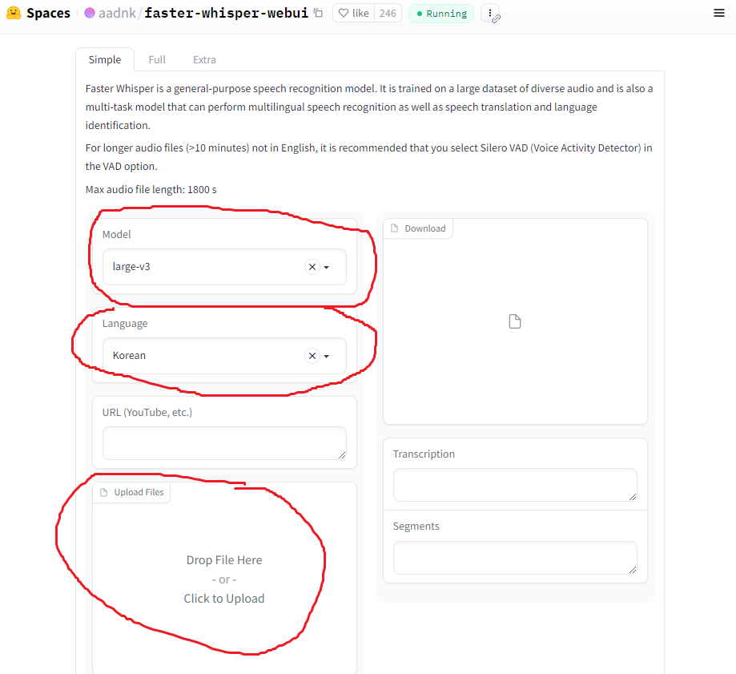
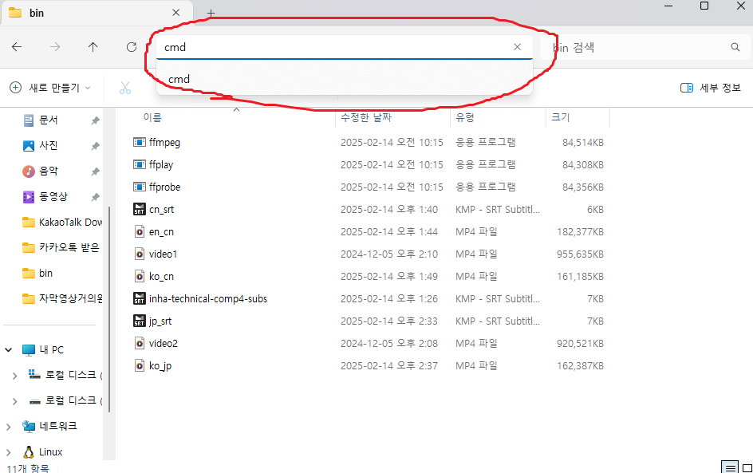

# 1. 영상 음성 추출
https://huggingface.co/spaces/aadnk/faster-whisper-webui  
해당 사이트에서 영상의 음성을 텍스트로 바꿔 자막파일로 다운로드한다.

- model: 아래로 선택할수록 좋다.  
(large-v3의 경우 6분 30초의 영상에 적용했을 때 1시간 가량의 시간 소요)
- Language: 영상 **음성**의 언어를 선택한다.
- 파일을 업로드한 뒤, 진행이 다 되었다면 .srt로 끝나는 파일을 다운로드한다.
- srt 파일을 메모장으로 열어 자막을 검수한다.
- 검수가 완료되었으면 내용을 복사한 뒤 Chat GPT를 이용하여 번역을 진행한다.  
(gpt4 이상의 버전 추천)

# 2. 자막 삽입
- 동영상 프로그램에 내장된 자막기능을 이용하여 자막을 볼 수 있지만  
아래의 서술은 영상자체에 자막을 입히는 방법이다.

- [ffmpeg 다운로드하기](https://github.com/BtbN/FFmpeg-Builds/releases/download/latest/ffmpeg-master-latest-win64-gpl-shared.zip)

이후 아래의 글에서 설정한 것과 동일하게 설정  
https://kyoko0825.tistory.com/entry/%EC%9C%88%EB%8F%84%EC%9A%B0-10%EC%97%90%EC%84%9C-ffmpeg-%EC%82%AC%EC%9A%A9%ED%95%98%EA%B8%B0

## 2-2. 실행

- ffmpeg.exe 파일이 있는 경로에 자막파일 및 동영상 넣기
- 위와 같이 ffmpeg.exe 파일이 있는 경로에서 cmd 실행
```bash
ffmpeg -i "video_name.mp4" -vf "subtitles=srt_name.srt" -c:a copy "translation_name.mp4"
```
- 위 명령을 수정한 뒤 입력하여 자막이 삽입된 영상 얻기
  - video_name: 영상의 이름
  - srt_name: 자막파일의 이름
  - translation_name: 자막을 넣은 영상에 지을 이름
